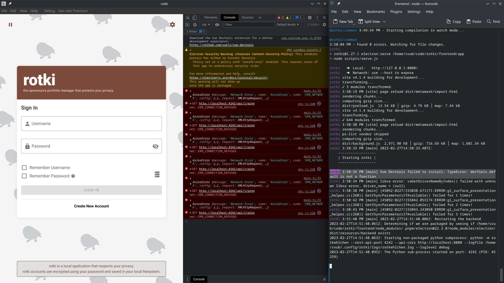

# Rotki

When it comes to crypto, many would agree to the 'not your keys, not your crypto' way of thinking. What applies to CEX vs DEX also applies IMO to keeping track of crypto and using a web platform vs having a local tool. Enter [Rotki](https://rotki.com/).

It's open source software and you can conveniently install the images for various operating systems and Linux distros. But if you want to tinker with it or want to run the development version, it's time to build from source...

## Building from source locally 

I just recently reinstalled my Fedora system. So it seems that some common Python and Node.js dev tools need to be added manually, otherwise following the [**Rotki setup guide**](https://rotki.readthedocs.io/en/latest/installation_guide.html) will lead to errors. I'll just share the issues and how I solved them here:

You'll need Node.js and NPM set up. I recommend using [NVM](https://github.com/nvm-sh/nvm#installing-and-updating) so you can switch your Node.js version with ease. After cloning the Rotki repo with `git clone` you hop into the `rotki` folder and install the latest long-term support Node.js version there with `nvm install --lts --latest-npm` -- this also adds NPM at the same time.

OK, so the repo is cloned and we installed `npm` as explained.

Next error: `mkvirtualenv` is not available. Following [The Hitchhiker's Guide to Python](https://docs.python-guide.org/dev/virtualenvs/) we need to `virtualenv` which can be installed via `pip install virtualenv`.

Next: `pip` not available. For Fedora, [this guide helps](https://developer.fedoraproject.org/tech/languages/python/pypi-installation.html): `sudo dnf install python3-pip`. Then installing `virtualenv` works like a charm with ``pip install virtualenv`.

Thus, instead of `mkvirtualenv` we'll be using `virtualenv`. So the command would be `virtualenv rotki -p /usr/bin/python3.9`.
Error: `FileNotFoundError: [Errno 2] No such file or directory: '/usr/bin/python3.9'`. Simple solution: use the version installed on your system, for me it was `python3.10`.
**A message from future me: No no no, not so fast there! Make sure it's Python 3.9! As I found out later, Python 3.something seems to work at first but caused a strange issue later on. So make sure that you have 3.9 installed:** `dnf install python3.9`

Trying again `pip install -r requirements.txt` resulted in `"fatal error: Python.h: No such file or directory"`. This beautifully complete [answer on StackOverflow](https://stackoverflow.com/questions/21530577/fatal-error-python-h-no-such-file-or-directory#21530768) brought the solution: `sudo dnf install python3-devel`.

Seemed all fine, but a few warnings in the terminal running the `pip install` command remained: `WARNING: Legacy build of wheel for 'rotki-pysqlcipher3' created no files.`

Finally trying then to run `npm run dev` revealed indeed, there was something missing: `ModuleNotFoundError: No module named 'pysqlcipher3'`. Which made the local web server -- which is written in Python and serves the data to the UI front-end -- fail.

So going back to those warnings (I'm leaving the long warning message out for the sake of brevity) hinted to run the command in `--verbose` for more information. Doing that revealed a few more critical lines just before the warning:

```
SQL Cipher amalgamation not found. Please download or build the
          amalgamation and make sure the following files are present in the
          amalgamation folder: sqlite3.h, sqlite3.c
```

Searching for that got me [this good StackOverflow answer](https://stackoverflow.com/a/58426024/548955) recommending that SQLCipher dev files are missing. Tried that, didn't work. Taking a break and recharging with a big cup of coffee ... and then looking back at what I did or rather what I did differently, I noticed Python 3.9 in the docs vs Python 3.10 which I used. No way this can be causing it, right? I was desperate enough to try it out. And guess what?!? Yes! Unbelievable IMO, but here we go:


Almost perfect... you can see following message in the screenshot:
```
rotki 3:50:34 PM [main] Vue Devtools failed to install: TypeError: devTools.default is not a function
```

And it was smooth sailing from then on.

Okay almost. To work on the front-ends which are written in Vue.js, Vue Devtools are essential. Though the docs show how to run the front-end in the browser, where you can install Devtools easily, it would be nice to have it running in the Electron window where it will also run in production. 

